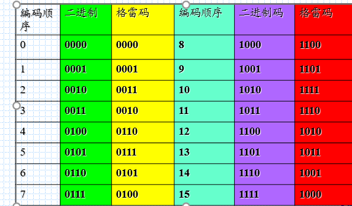

# 1.1概述

## 数字量和模拟量

+ 数字量：变化在时间上和数量上都是不连续
+ 模拟量：数字量之外的物理量
+ 电子电路作用：处理信息
+ 模拟电路：用连续的模拟电压/电流值表示信息

# 1.2几种常见的数制

+ 数制：
  + 每一位的构成
  + 低位到高位的进位规则

# 1.3 数制转换

+ 十—二转换 整数部分除二取余倒排、小数乘二取整正排

# 1.4 二进制运算

## 1.4.2 反码补码运算

+ 正数补码和原码一样
+ 负数反码除去符号位取反
+ 负数补码为反码加1
+ 减法通过补码进行实现

# 1.5几种常用的编码

+ 十进制
+ 格雷码：每一位状态变化按照一定顺序、相邻只改变一位
+ 
+  ASCⅡ：七位二进制