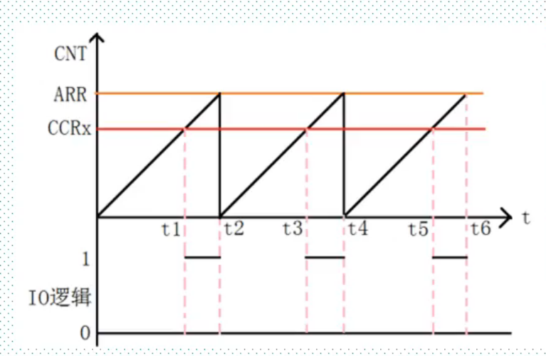

# PWM输出实验

## 1.通用定时器PWM概述

 

## 2.寄存器和库函数配置 

+ CCR捕捉比较寄存器
+ CCMR1：OC1M[2:0]设置PWM模式，模式1为110，模式2为111
+ CCER：CC1P输入/捕获输出极性，0高电平有效，1低电平有效
+ CCER:CC1E输入/捕获1输出使能。0关闭，1打开
+ TIM_OCxPreloadConfig()输出使能比较预装载
+ TIM_ARRPreloadConfig()使能自动装载的预装载寄存器允许位 ，修改ARR时，ARPE=1立即生效反之下个周期生效

+ TIM_OCxInit()初始化配置参数
+ TIM_SetCompareX()修改占空比

## 配置步骤

+ 使能定时器和IO口RCC_APB1PeriphClockCmd()/RCC_AHB1PeriphClockCmd()
+ IO初始化函数 GPIOx_Init()复用模式
+ GPIO映射GPIO_PinAFConfig()
+ 初始化定时器TIM_TimeBaseInit()
+ 初始化参数TIM_OCxInit()
+ 使能预装载寄存器TIM_OCxPreloadConfig(),TIM_ARRPreloadConfig()
+ 使能定时器TIMx_Cmd（）
+ TIM_SetCompareX()修改占空比

