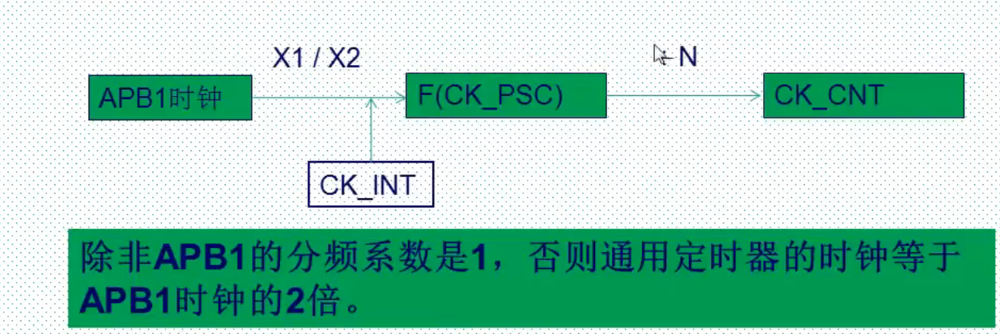

# 定时器的中断实验

+ 时钟的选择
  + 内部时钟CK_INT
    + 
    + SYS=168>>AHP=168>>AHP1=42>>CK_INT=84
  + 外部时钟1：外部输入引脚TIx
  + 外部时钟2：外部触发输入ETR(TIM2/4)
  + 内部触发输入ITRx

+ 计数模式选择
  + 向上计数

+ 记录当前值寄存器CNT
+ 预分频寄存器TIMx_PSC
+ 自动重装载寄存器TIMx_ARR
+ 控制寄存器 TIM_CR1控制使能和计数模式
+ DMA中断使能寄存器TIM_DIER使能中断
+ 定时器参数初始化TIM_TimeBaseInit();
+ 定时器使能TIM_Cmd()
+ 定时器中断使能TIM_ITConfig()

# 中断实现步骤

+ 使能时钟RCC_APB1PeriphClockCmd()
+ 初始化定时器TIM_TimeBaseInit();
+ 开启定时器中断NVIC_Init()
+ 使能定时器TIM_Cmd()
+ 定时器中断使能TIM_ITConfig()
+ 编写中断服务函数TIMx_IRQHandler()
+ Tout=(ARR+1)(PSC+1)/Tclk