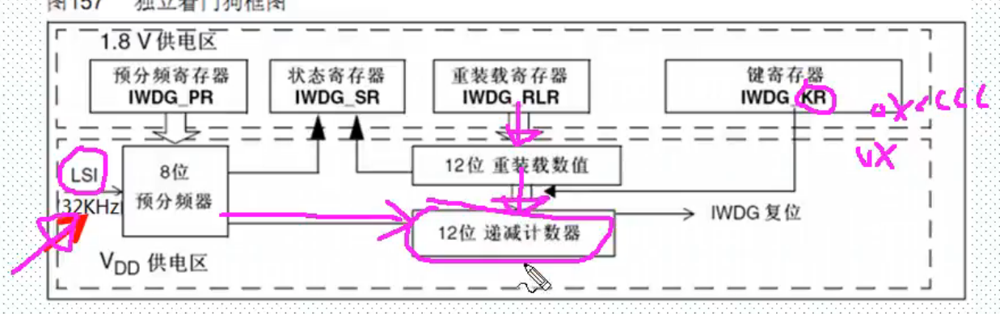

# 独立看门狗

## 1. 独立看门狗概述

+ 看门狗检测单片机程序运行状态的模块或者芯片

+ 程序跑飞，看门狗执行使系统复位

+ 独立看门狗IWDG(LSI)32khz

+ 键值寄存器IWDG_KP写入0xCCCC开启看门狗 计数器会从复位值oxFFF递减，到零产生复位信号IWDG_RESET，在KR写入0xAAAA（喂狗），自动重载寄存器IWDG_RLR重新装载到计数器，防止复位，程序异常，无法喂狗，系统复位

  

键值寄存器IWDG_KR 0~15（写入0x5555解除保护）\预分频寄存器IWDG_PR 0~2具有写保护，操作前需要取消保护\重装 寄存器IWDG_RLR 0~11有写保护，操作前需要取消保护\状态寄存器IWDG_SR 0~1

+ 溢出时间计算 Tout=((4X2^prer)Xrlr)/32

## 2.操作库函数

+ IWDG_WriteAccessCmd(IWDG_WriteAccess_Enable);取消保护
+ void IWDG_SetPrescaler(uint8_t IWDG_Prescaler); //设置 IWDG预分频值
+ void IWDG_SetReload(uint16_t Reload); //设置 IWDG重装载值
+ IWDG_Enable(); //使能 IWDG
+ IWDG_ReloadCounter(); //按照 IWDG重装载寄存器的值重装载 IWDG计数器，喂狗
+ FlagStatus IWDG_GetFlagStatus(uint16_t IWDG_FLAG);

