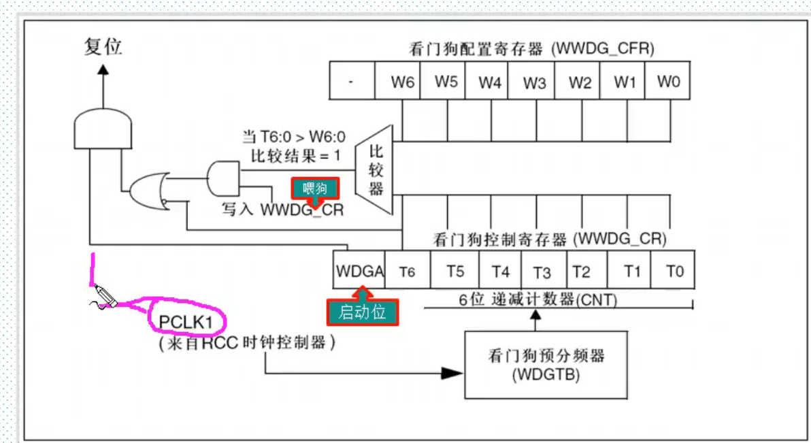

# 窗口看门狗

## 1.窗体看门狗概述

+ 喂狗时间存在上下限称为窗口（下限固定）
+ 窗口之间才能喂狗，之外会复位
+ 下限3F(16)
+ 
+ 如果启动了看门狗并且允许中断，递减计数器等于0x40产生早起唤醒中断（EWI）他可以用来喂狗防止复位
+ Twwdg=(4096X2^WDGTBX(T[5:0]+1))/Fpclk1

## 2.常用寄存器和库函数

+ 控制寄存器 WWDG_CR
+ WWDG_Enable()启动并设置初始值
+ WWDG_SetCounter()喂狗
+ 配置寄存器WWDG_CFR储存上窗口值和预分屏系数
+ WWDG_EnableIT()使能提前唤醒中断‘
+  WWDG_SetPrescaler();
+ WWDG_SetWindowValue()
+ 状态寄存器WWDG_SR
+ FlagStatus WWDG_getFlagStatus()
+ WWDG_ClearFlag()

## 3.配置过程

+ 使能看门狗时钟 RCC_APB1PeriphClockCmd();
+ 设置分频系数WWDG_SetPrescaler();
+ 设置上窗口值WWDG_SetWindowValue()
+ 开启提前唤醒中断并分组（可以取消）WWDG_EnableIT()\NVIC_Init();
+ 使能看门狗WWDG_Enable()
+ 喂狗WWDG_SetCounter()
+ 编写中断服务函数WWDG_IRQHandler()

