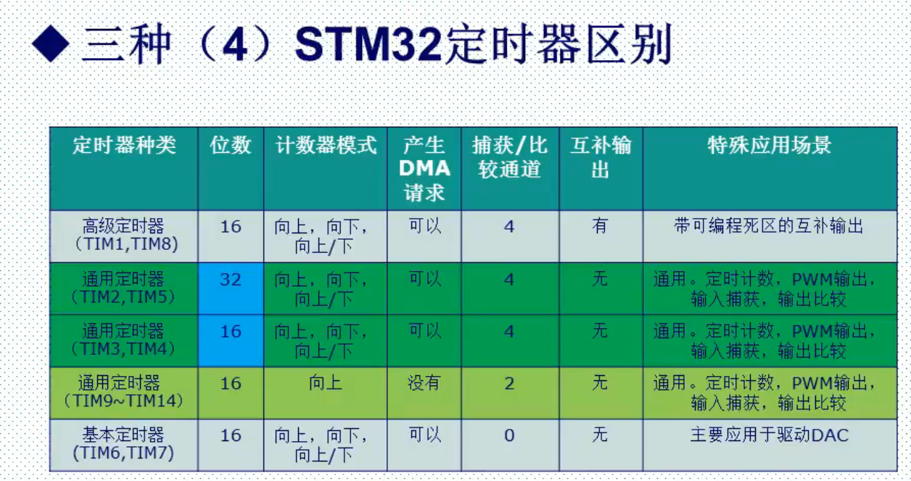

# 通用定时器基本原理

## 1.三种定时器区别

### STM32定时器数量

## 2.通用计时器特点

TIM2TIM5\TIM3TIM4

+ 自动装载计数器（TIMx_CNT）四种计数模式
+ 16位可编程预分频器（TIMx_PSC）
+ 四个独立通道（TIMx_CH1~4）
  + 输入捕获
  + 输出比较
  + PWM生成
  + 单脉冲模式输出

+ 可使用外部信号（TIMx_ETR）控制定时器和定时器互联的同步电路
+ 产生中断、DMA(六个独立的URQ和DMA请求生成器)
  + 计数器初始化
  + 触发事件
  + 输入捕获
  + 输出比较
  + 支持针对定位增量编码器和霍尔传感器电路
  + 触发输入作为外部时钟或周期的电源管理

+ 通用计时器可以作为测量输入信号的脉冲长度，或者产生PWM、输出比较波形
+ 使用定时器与分频器和RCC时钟控制器预分频器，脉冲长度和波长周期可以在几个微秒到毫秒之间调整，几个定时器完全独立

## 计数器模式

+ 向上计数，从0到自动加载值TIMx_ARR,然后重新从0计数，产生一个计数器向上溢出事件
+ 向下计数，从自动加载值TIMx_ARR到0,然后重新从TIMx_ARR计数，产生一个计数器向下溢出事件
+ 中央对齐，计数器从0开始计数到自动装载的值TIMx_ARR-1，产生一个计数器溢出事件，然后TIMx_ARR向下计数到1产生一个计数器溢出事件，然后从0开始重新计数

