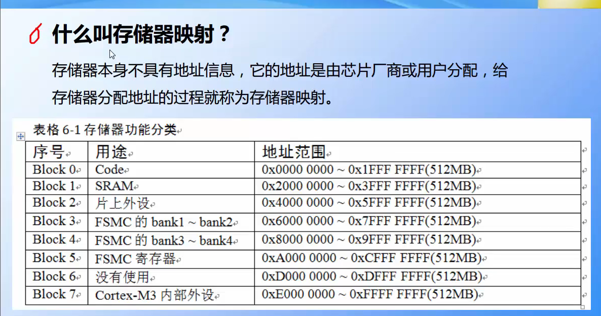
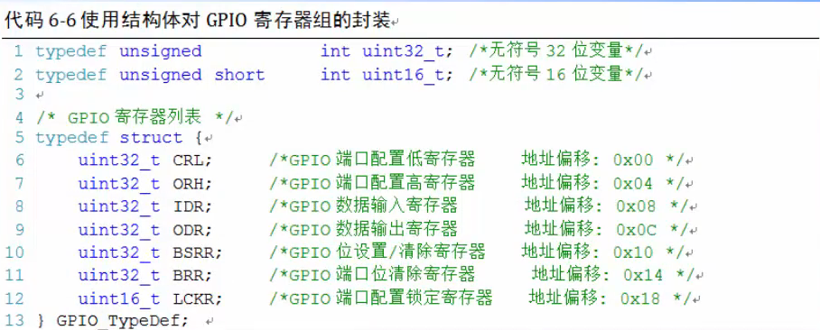
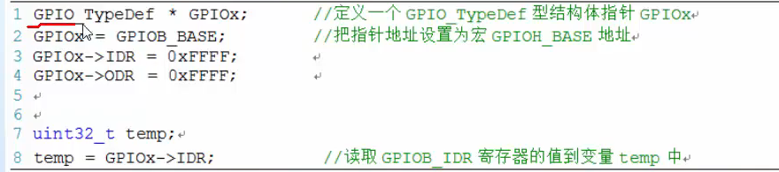
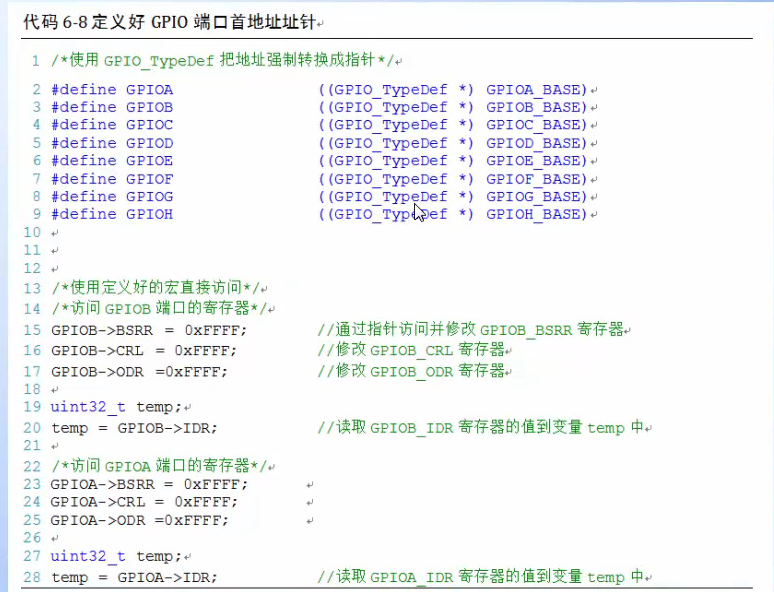

# stem32寄存器
##　芯片正方向，从小圆点（两个较小的）逆时针旋转｜｜正看丝印

## 寄存器(特定功能的内存单元的别名)映射（过程为映射）

## 绝对地址访问内存单元
**(unsigned int* *）	(0x40010C0C)=0xFFFF

## 寄存器别名访问内存单元
#define GPIOB_ODR 	(unsignedint*)(0x40010C0C)
*GPIOB_ODR=0xffff
or
#define GPIOB_ODR 	* (unsignedint*)(0x40010C0C)
GPIOB_ODR=0xffff

## 总线基地址+偏移量=实际地址
## C语言对寄存器的封装
## 如何实现PBO输出低/高电平
#定义 外设地址基准
#定义APB地址
#定义FPIOB地址
#定义FPIOBODR地址
a=(1<<10)%%10位置1，其他变0
将变量a的第30位置1，其他位保持不变。
a|=1<<30;

将变量a的第24、30位置1，其他位保持不变。
a|=(1<<30)|(1<<24);

将变量a的第30位取反，其他位保持不变。
a^=(1<<30);

将变量a的第30位清零，其他位保持不变。
a&=~(1<<30);

GOIOB_ODR &=~（1<<0）
GPIOB_ODR |=(1<<0)
##　使用结构体指针访问寄存器

　

