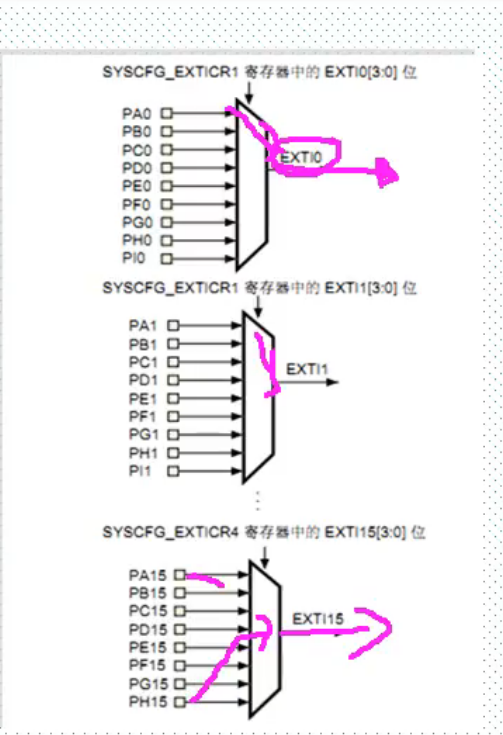

# 外部中断

## 1.外部中断概述

+ 每个io都能当为外部中断输入

+ EXTI线0~15 对应外部中断io口的输入中断
+ 16 连接PVD输出
+ 17 连接RTC闹钟事件
+ 18 连接USB OTG FS 唤醒事件
+ 19 连接以太网唤醒事件
+ 20  连接USB OTG FS唤醒事件（FS中配置）
+ 21 连接入侵和时间戳事件
+ 22连接RTC唤醒事件

### 1.1 触发方式

+ 独立
+ 上升沿、下降沿、双边沿
+ 触发/屏蔽
+ 专用的状态位

### 1.2 映射关系

+ GOIOX.0映射到EXTI0
+ GOIOX.15映射到EXTI15
+ 同一时刻 一个中断线只有一个IO中断

### 1.3 中断服务函数

+ 总共七个中断向量——七个中断服务函数0、1、2、3、4、5—9、10—15
+ 映射IO口、初始化触发方式、开启中断
+ SYSCFG_EXTILineCongfig()//映射IO
+ EXTI_Init()//初始化中断线
+ EXTI_GetITStatus()//标志中断状态是否发生
+ EXTI_ClearITPendingBit()//清除中断线中断标志位

### 1.4 一般配制步骤

1. 使能SYSCFG时钟RCC_APB2PeriphClockCmd()
2. 初始化IO口为输入GPIO_Init()
3. 设置映射关系SYSCFG_EXTILineConfig()
4. 初始化中断EXTI_Init()
5. 中断分组，使能中断NVIC_Init()
6. 中断服务函数EXTIx_IRQHAndler()
7. 清除中断标志位 EXTI_ClearITPendingBit()

