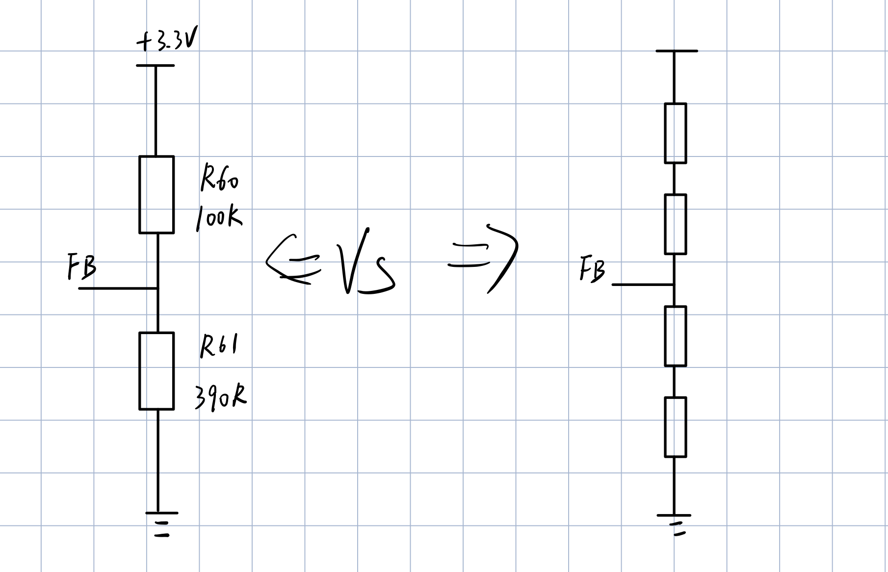
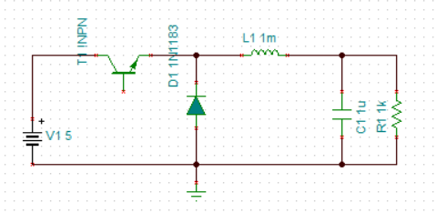
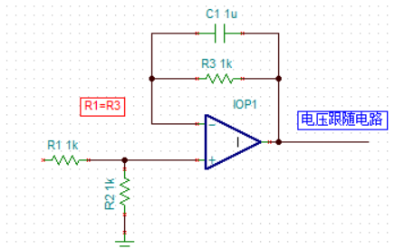
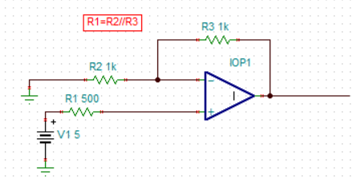

# 硬件学习
## 电阻
#### 应用
1. 分压——buck开关电源精确的输出电压（反馈端电阻分压网络）

   ==反馈分压电路为什么用了四个电阻？==

   E3系列电阻值——10^1/3^公比 1-2.2-4.7-10

   + 由于电阻阻值是离散分布的，因此需要两个乃至多个电阻拼凑来满足特定的电阻分压要求
   
   + 选择高精度电阻
   
     
   
   ==buck开关电源拓扑结构==
   
   buck\boost\buck-boost取决电感位置
   
   
   
   ==开关管闭合打开产生电压信号的串扰？==
   
   + 开关电源电容电感远离FB，防止交变信号耦合到反馈网络
   
2. 运放如何消除偏执电流影响

   

   实际运放不像理想运放满足虚断，而是有偏置电流，导致正负输入端输入电压为0而输出电压不为0==为了减小偏置电流的大小，应该对在正向输入端添加一个输入电阻并且对电阻的阻值进行选择==使正向输入端电阻=反相输入端电阻//反馈电阻

   ==运放分析==
   
   实际运放存在共模抑制比CMRR、输入偏置电流I~bias~+/2、输入失调电流I~off~-，一般I~off~<=I~bias~/4
   
3. 指示灯电路——限流

   

   

   

 

